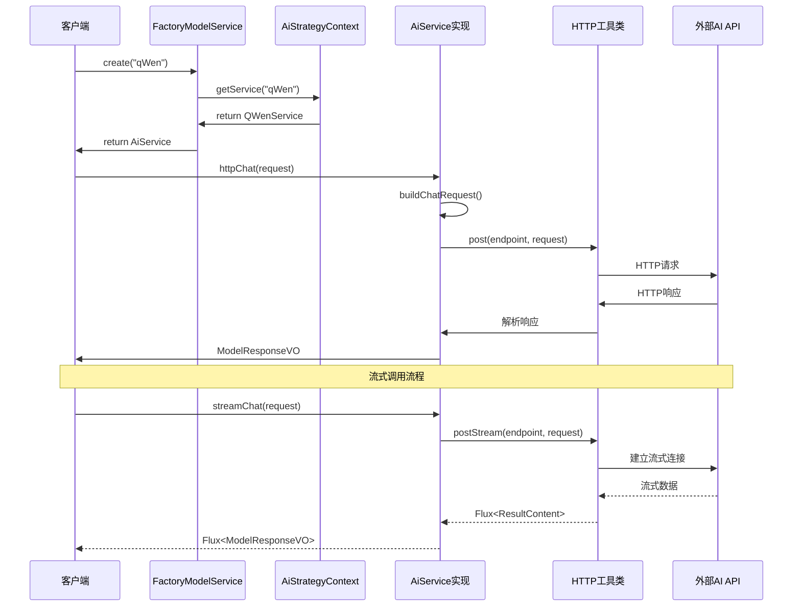

```mermaid
sequenceDiagram
    participant Client as 客户端
    participant Factory as FactoryModelService
    participant Context as AiStrategyContext
    participant Service as AiService实现
    participant Utils as HTTP工具类
    participant API as 外部AI API
    
    Client->>Factory: create("qWen")
    Factory->>Context: getService("qWen")
    Context->>Factory: return QWenService
    Factory->>Client: return AiService
    
    Client->>Service: httpChat(request)
    Service->>Service: buildChatRequest()
    Service->>Utils: post(endpoint, request)
    Utils->>API: HTTP请求
    API->>Utils: HTTP响应
    Utils->>Service: 解析响应
    Service->>Client: ModelResponseVO
    
    Note over Client,API: 流式调用流程
    Client->>Service: streamChat(request)
    Service->>Utils: postStream(endpoint, request)
    Utils->>API: 建立流式连接
    API-->>Utils: 流式数据
    Utils-->>Service: Flux<ResultContent>
    Service-->>Client: Flux<ModelResponseVO>
``` 