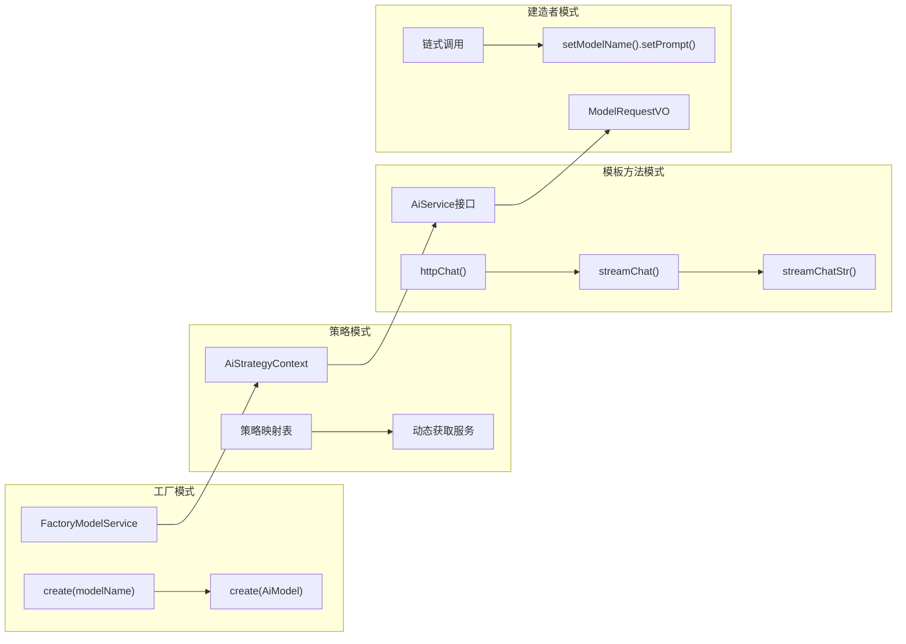

```mermaid
graph LR
    subgraph "工厂模式"
        F1["FactoryModelService"]
        F2["create(modelName)"]
        F3["create(AiModel)"]
    end
    
    subgraph "策略模式"
        S1["AiStrategyContext"]
        S2["策略映射表"]
        S3["动态获取服务"]
    end
    
    subgraph "模板方法模式"
        T1["AiService接口"]
        T2["httpChat()"]
        T3["streamChat()"]
        T4["streamChatStr()"]
    end
    
    subgraph "建造者模式"
        B1["ModelRequestVO"]
        B2["链式调用"]
        B3["setModelName().setPrompt()"]
    end
    
    F1 --> S1
    S1 --> T1
    T1 --> B1
    
    F2 --> F3
    S2 --> S3
    T2 --> T3
    T3 --> T4
    B2 --> B3
``` 