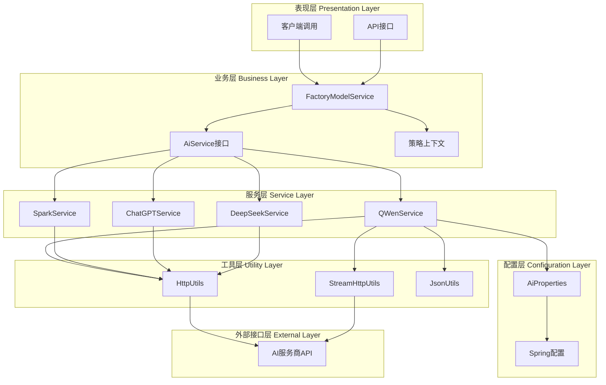

```mermaid
graph TB
    subgraph "表现层 Presentation Layer"
        P1["客户端调用"]
        P2["API接口"]
    end
    
    subgraph "业务层 Business Layer"
        B1["FactoryModelService"]
        B2["AiService接口"]
        B3["策略上下文"]
    end
    
    subgraph "服务层 Service Layer"
        S1["QWenService"]
        S2["SparkService"]
        S3["ChatGPTService"]
        S4["DeepSeekService"]
    end
    
    subgraph "工具层 Utility Layer"
        U1["HttpUtils"]
        U2["StreamHttpUtils"]
        U3["JsonUtils"]
    end
    
    subgraph "配置层 Configuration Layer"
        C1["AiProperties"]
        C2["Spring配置"]
    end
    
    subgraph "外部接口层 External Layer"
        E1["AI服务商API"]
    end
    
    P1 --> B1
    P2 --> B1
    B1 --> B2
    B1 --> B3
    B2 --> S1
    B2 --> S2
    B2 --> S3
    B2 --> S4
    S1 --> U1
    S1 --> U2
    S1 --> U3
    S1 --> C1
    S2 --> U1
    S3 --> U1
    S4 --> U1
    C1 --> C2
    U1 --> E1
    U2 --> E1
``` 