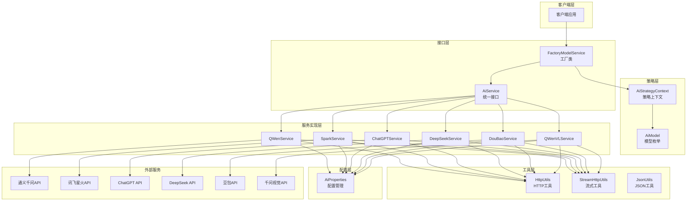

```mermaid
graph TB
    subgraph "客户端层"
        Client["客户端应用"]
    end
    
    subgraph "接口层"
        Factory["FactoryModelService<br/>工厂类"]
        Interface["AiService<br/>统一接口"]
    end
    
    subgraph "策略层"
        Context["AiStrategyContext<br/>策略上下文"]
        Enum["AiModel<br/>模型枚举"]
    end
    
    subgraph "服务实现层"
        QWen["QWenService"]
        Spark["SparkService"] 
        ChatGPT["ChatGPTService"]
        DeepSeek["DeepSeekService"]
        DouBao["DouBaoService"]
        QWenVL["QWenVLService"]
    end
    
    subgraph "工具层"
        HttpUtils["HttpUtils<br/>HTTP工具"]
        StreamUtils["StreamHttpUtils<br/>流式工具"]
        JsonUtils["JsonUtils<br/>JSON工具"]
    end
    
    subgraph "配置层"
        Config["AiProperties<br/>配置管理"]
    end
    
    subgraph "外部服务"
        QWenAPI["通义千问API"]
        SparkAPI["讯飞星火API"]
        ChatGPTAPI["ChatGPT API"]
        DeepSeekAPI["DeepSeek API"]
        DouBaoAPI["豆包API"]
        QWenVLAPI["千问视觉API"]
    end
    
    Client --> Factory
    Factory --> Context
    Context --> Enum
    Factory --> Interface
    Interface --> QWen
    Interface --> Spark
    Interface --> ChatGPT
    Interface --> DeepSeek
    Interface --> DouBao
    Interface --> QWenVL
    
    QWen --> HttpUtils
    QWen --> StreamUtils
    QWen --> Config
    QWen --> QWenAPI
    
    Spark --> HttpUtils
    Spark --> StreamUtils
    Spark --> Config
    Spark --> SparkAPI
    
    ChatGPT --> HttpUtils
    ChatGPT --> StreamUtils
    ChatGPT --> Config
    ChatGPT --> ChatGPTAPI
    
    DeepSeek --> HttpUtils
    DeepSeek --> StreamUtils
    DeepSeek --> Config
    DeepSeek --> DeepSeekAPI
    
    DouBao --> HttpUtils
    DouBao --> StreamUtils
    DouBao --> Config
    DouBao --> DouBaoAPI
    
    QWenVL --> HttpUtils
    QWenVL --> StreamUtils
    QWenVL --> Config
    QWenVL --> QWenVLAPI
``` 